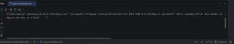

# 📚 Sistema de Cálculo de Média Escolar

Projeto desenvolvido em **Java** que realiza o cálculo da média de três notas informadas pelo usuário via terminal.

## 🚀 Funcionalidades

* Entrada de três notas
* Validação de valores (0 a 10)
* Cálculo da média aritmética
* Resultado automático:

  * Aprovado
  * Recuperação
  * Reprovado

## 🛠️ Tecnologias utilizadas

* Java
* Scanner (entrada de dados)
* IntelliJ IDEA

## ▶️ Como executar

1. Abra o projeto em uma IDE (IntelliJ, Eclipse ou VS Code)
2. Execute a classe `Main`
3. Digite as notas solicitadas no terminal

## 🎥 Demonstração
 

---

Desenvolvido para prática de lógica de programação e conceitos básicos em Java.
